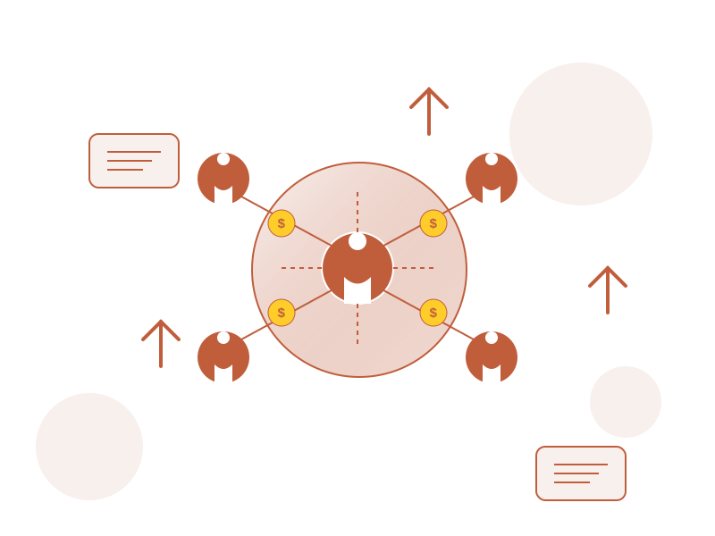

# ReferBiz

[](https://opensource.org/licenses/MIT)

A comprehensive referral marketing platform designed to help businesses increase customer acquisition through word-of-mouth marketing and referral campaigns.



## 🌟 Project Overview

ReferBiz is a full-stack web application that enables businesses to create, manage, and track referral marketing campaigns. The platform provides tools for setting up customized referral programs, tracking referral activities, managing rewards, and analyzing performance metrics.

### Key Components

- **Frontend**: React-based UI with Material-UI components
- **Backend**: Node.js/Express RESTful API
- **Database**: MongoDB for data storage
- **Authentication**: JWT-based authentication system

## 🚀 Features

- **User Authentication**: Secure login and registration system
- **Dashboard**: Overview of referral performance metrics
- **Campaign Management**: Create and customize referral campaigns
- **Referral Tracking**: Generate and monitor referral links
- **Contact Management**: Organize and manage contact lists
- **Reward System**: Set up and distribute rewards for successful referrals
- **Messaging System**: Send emails and SMS to potential referrals
- **Analytics**: Track conversion rates and campaign performance
- **Mobile Responsive**: Works on desktop and mobile devices

## 📋 Technology Stack

### Frontend
- React.js
- Material-UI
- Vite
- React Router
- Axios
- Chart.js

### Backend
- Node.js
- Express.js
- MongoDB
- Mongoose
- JWT Authentication
- Bcrypt

## 📦 Repository Structure

```
/
├── frontend/              # React frontend application
├── backend/               # Node.js/Express backend API
├── .gitignore             # Git ignore file
└── README.md              # Main project documentation
```

## 🔧 Installation

### Prerequisites

- Node.js (v14.0.0 or later)
- MongoDB (v4.0 or later)
- npm or yarn

### Setup and Installation

1. Clone the repository
```bash
git clone https://github.com/Arjunhg/Agent_assignment.git
cd Agent_assignment
```

2. Install and configure the backend
```bash
cd backend
npm install
# Create a .env file with required configuration
npm run dev
```

3. Install and run the frontend
```bash
cd ../frontend
npm install
npm run dev
```

For detailed installation instructions, please refer to:
- [Frontend README](./frontend/README.md)
- [Backend README](./backend/README.md)

## 🔍 Usage

1. Register an account on the platform
2. Log in with your credentials
3. Create a new referral campaign with customized rewards
4. Add contacts or import them from a CSV file
5. Generate referral links to share with your customers
6. Track referral activities and conversions on the dashboard
7. Manage and distribute rewards to successful referrers

## 🚢 Deployment

### Backend Deployment (Render)

The backend is configured for easy deployment on Render:
- Web service with Node.js runtime
- Environment variables for configuration
- Automatic deployments from GitHub

### Frontend Deployment (Vercel)

The frontend is optimized for deployment on Vercel:
- Zero-configuration setup
- Environment variables for API connection
- Preview deployments for PRs

Detailed deployment instructions are provided in each component's README.

## 🧪 Testing

### Backend
```bash
cd backend
npm test
```

### Frontend
```bash
cd frontend
npm test
```

## 🤝 Contributing

Contributions are welcome! Please feel free to submit a Pull Request.

1. Fork the repository
2. Create your feature branch (`git checkout -b feature/amazing-feature`)
3. Commit your changes (`git commit -m 'Add some amazing feature'`)
4. Push to the branch (`git push origin feature/amazing-feature`)
5. Open a Pull Request

## 📝 License

This project is licensed under the MIT License - see the [LICENSE](LICENSE) file for details.

## 📞 Contact

Project Link: [https://github.com/Arjunhg/Agent_assignment](https://github.com/Arjunhg/Agent_assignment)

## 🙏 Acknowledgements

- [React](https://reactjs.org/)
- [Material-UI](https://mui.com/)
- [Express](https://expressjs.com/)
- [MongoDB](https://www.mongodb.com/)
- [Render](https://render.com/)
- [Vercel](https://vercel.com/)
